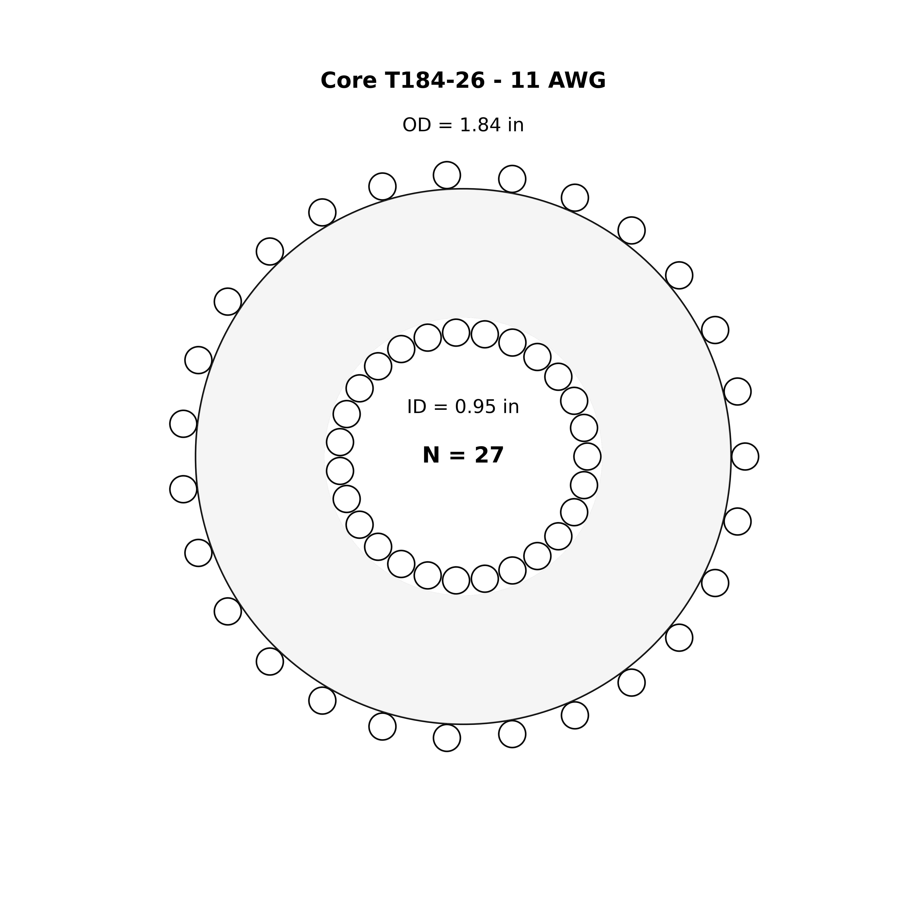

# Toroid Universe

A tool for exploring single-layer toroidal inductor configurations. This tool helps calculate and visualize possible winding combinations for toroidal cores using different wire gauges.

## Features

- Calculates realizable winding combinations for toroidal cores
- Toroid dataset includes Mag-Inc and Micrometals cores.
- Generates detailed visualization diagrams
- Computes inductance and fill factors
- Multiple visualization styles (B&W, Color, Creative)
- Random sampling option for exploring possibilities

## Example Output

Here's an example visualization of a T184-26 core wound with 11 AWG wire:



## Usage

Basic usage:
```bash
python toroid-universe.py
```

Generate visualizations for all combinations !WARNING! There are >8000 combinations currently:
```bash
python toroid-universe.py --generate-plots
```

Generate 10 random visualizations:
```bash
python toroid-universe.py --random-plots 10
```

Change visualization style:
```bash
python toroid-universe.py --random-plots 5 --style creative
```

## Output

The tool generates a comprehensive [results table](example/master-table.ipynb) containing the realizable single layer toroid configurations.

## License
Copyright 2025 Andrew Meares
MIT License
